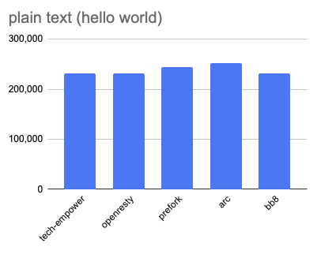
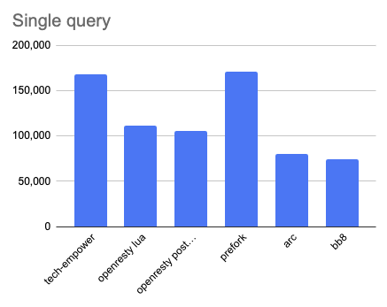
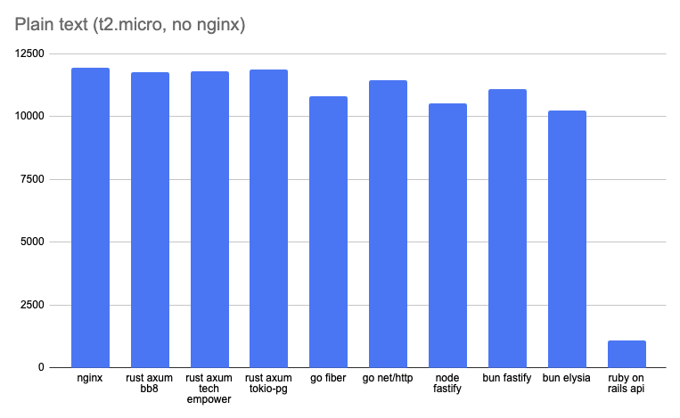
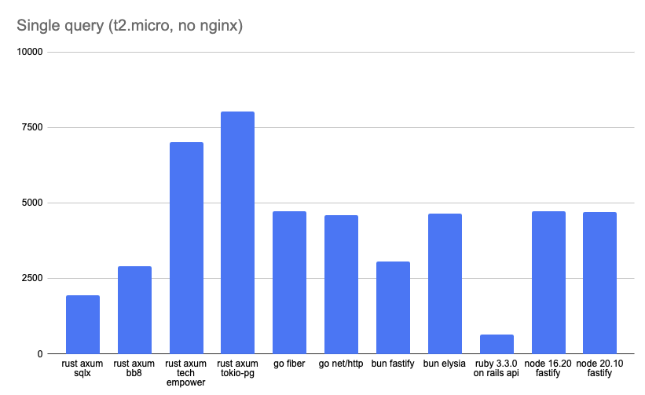

# Framework test at home

> Me: Can we have a framework performance test? \
> Mom: we have framework performance test at home \
> Framework performance test at home:

## Why

Because I wanted to understand the difference between the frameworks and how they perform in a real world scenario.

Plus I had this very specific use case to fetch a single int from database and send it to the client.
I started from the tech empower benchmarks but I didn't understand a lot of things about their testing method and setup
so I decided to do my own.

## Setup

- t2.micro EC2 instance as client in eu-central-1a
- t2.micro EC2 instance as server in eu-central-1a
- db.t3.micro RDS instance in eu-central-1a

I have also ran the tests on a t3a.xlarge EC2 instance in eu-central-1a and the results were pretty much the same.

I had ran the tests with and without nginx.
As it turns out nginx doesn't get the processing power from the astral plane and its resource usage affected the results.

2 endpoints:

- `/` - hello world as plain text
- `/count` - fetches a single int from database and sends it to the client as plain text

## Running the tests

- rewrk is used as a testing tool: `rewrk -c 50 -t 2 -d 30s -r 5 -h http://localhost...` is the command to run the tests
- on edge the `./build.sh` and the `./bench.sh` scripts were used

Every test was ran 5 times and the average of the 5 runs was used to compensate for the changes in the environmental conditions.

The output from the last run can be found in the `raw_output.txt`

## Results

https://docs.google.com/spreadsheets/d/1qxV0QYc6v51SDrhph7MY6PEOdoGL_IYRNgvRJmV1GKk/edit#gid=0

### Without nginx on 16cpu 32gb ram server

### Without nginx on a t2.micro

